# Everything Explained Simply
## F1 Predictive AI and Driver Anomaly Analysis
### Written for someone who has never studied data science or machine learning

---

**Submitted by:** Anas Norani · Hanan Majeed · Maha Mohsin  
**Program:** BS Data Science — SEECS, NUST · June 2026

---

## Before We Start: The One Sentence Version

> We used real Formula 1 car sensor data to teach a computer to **predict** what aerodynamic mode the car will need **1 second before it gets there** — so the car can prepare in advance instead of reacting too late.

That is the whole project. Everything below is just explaining what that means, how we did it, and what we found.

---

## Part 1 — What Is Formula 1 and Why Does Any of This Matter?

### What is a Formula 1 car?

Formula 1 is the highest level of car racing in the world. The cars are the fastest road-going race cars on Earth — they can reach 370 kilometres per hour and go from 0 to 100 km/h in under 2 seconds.

These cars are not just powerful — they are incredibly sophisticated machines packed with hundreds of sensors measuring everything about the car every single moment: speed, engine RPM, gear, how hard the driver is pressing the throttle or brake, the exact GPS position, temperature, tyre wear, and much more.

### What is aerodynamics?

Aerodynamics is the science of how air interacts with objects moving through it.

When a car moves fast, air pushes against it. Engineers can design the car's wings (like an upside-down airplane wing) to either:

- **Push the car DOWN into the ground** (called **downforce**) — this gives more grip in corners so the car doesn't slide
- **Let air slip past smoothly** (called **low drag**) — this allows the car to go faster on straight roads

Think of it like a hand out of a car window:
- If you tilt your hand flat, air slips over it easily — **low drag**
- If you tilt your hand up like a wall, air pushes it back hard — **high drag but more force**

### The 2026 Rule Change — Active Aerodynamics

In 2026, Formula 1 introduced a new rule. Cars now have **wings that can physically change shape** while driving. They automatically switch between two positions:

| Mode | Wing Position | When Used | Effect |
|---|---|---|---|
| **Z-Mode** | Wings fully open (like a wall) | In corners | Maximum downforce — better grip |
| **X-Mode** | Wings flat (like a blade) | On straights | Minimum drag — maximum speed |

**The switch happens automatically** when:
- Speed reaches **240 kilometres per hour**, AND
- The driver is in **gear 6 or higher**

Both conditions must be true at the same time.

**The graph below shows exactly how clearly speed separates the two modes in real data:**

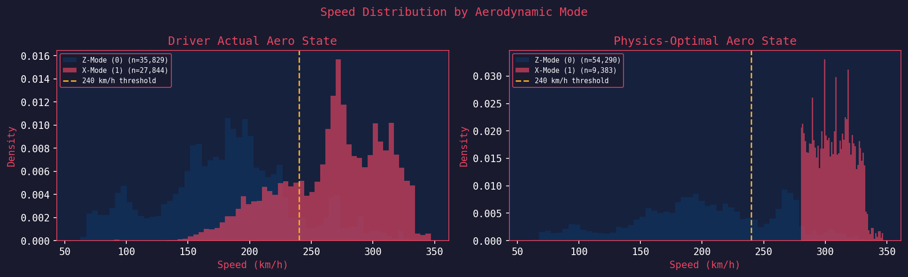

*You can see the car has two speed "worlds": a fast world (X-Mode, right cluster) and a slower world (Z-Mode, left cluster). The gap between them is real and measurable.*

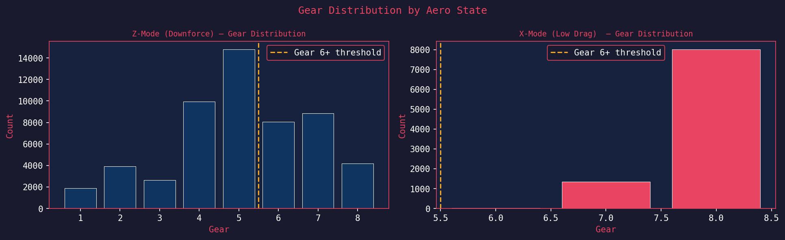

*The gear number is equally clean — X-Mode only ever happens in gears 6, 7, or 8.*

### The Problem — The System Reacts Too Late

Here is the problem: **the switch is not instant**.

When the car crosses the 240 km/h threshold, the system detects it and starts changing the wing. But changing a wing position takes time — about 0.1 to 0.3 seconds. By the time the wing finishes moving, the car has already traveled 20–30 metres further down the straight.

It is like a traffic light that turns green but you only see it after you have already passed the intersection.

**Our solution:** What if, instead of *reacting* when the car hits 240 km/h, the computer *predicts* that the car is *about to hit* 240 km/h in the next second? Then the wing can start moving early and be in the right position exactly when needed.

This is the whole motivation for the project.

---

## Part 2 — The Data We Used

### What is telemetry data?

Telemetry means "measurements sent from far away." In Formula 1, every car is constantly sending data to the team's computers. This data is recorded at **10 times per second** — that means 10 separate measurements for every single second of driving.

### Where did we get the data?

We used a free Python tool called **FastF1** that downloads official Formula 1 timing data. It is publicly available — anyone can use it.

### Phase 1 Data (for our first experiment)

We used data from **one race** — the 2026 Japanese Grand Prix at Suzuka circuit.

- **Number of data points:** 63,673
- **Drivers:** Max Verstappen and Isack Hadjar
- Think of it as a table with 63,673 rows and each row is one measurement taken at one moment in time

**This is the Suzuka circuit — the track we used for Phase 1:**

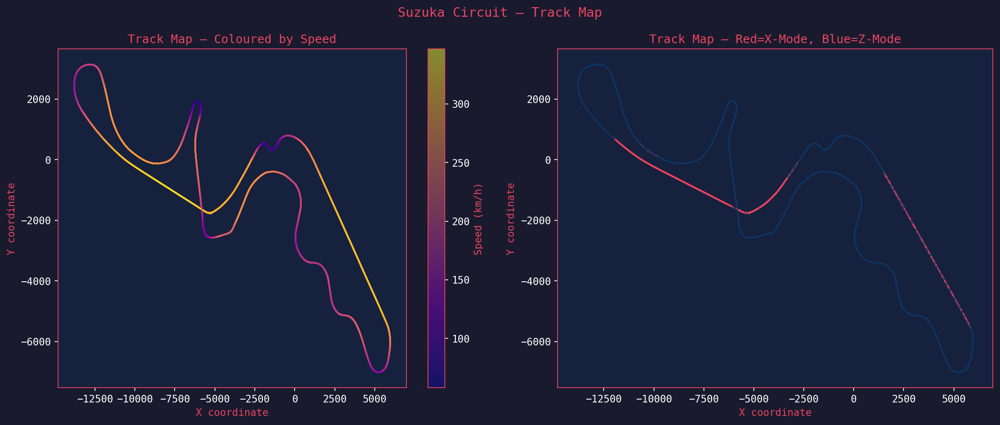

*Each dot on this map is one data point from the sensors. The entire lap is covered — corners, straights, and everything in between.*

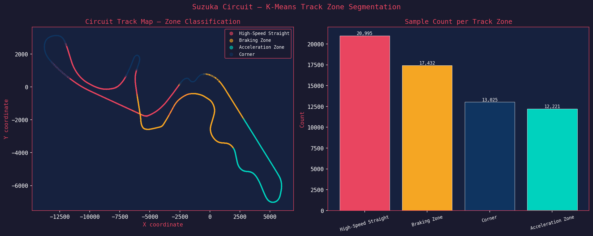

*When we divide the track into zones (braking zones, acceleration zones, straight zones), different colours show which part of the circuit each zone corresponds to.*

### Phase 2 Data (for our main experiment)

We used data from **four different races on four different circuits**:

| Circuit | Country | Race | Data Points | X-Mode Used |
|---|---|---|---|---|
| Monaco | Monaco | 2025 Monaco GP | 39,881 | 13% of the time |
| Monza | Italy | 2025 Italian GP | 31,098 | 57% of the time |
| Silverstone | UK | 2025 British GP | 25,060 | 38% of the time |
| Suzuka | Japan | 2026 Japanese GP | 63,673 | 35% of the time |
| **Total** | | | **159,712** | |

**Why these four circuits?** Because they are completely different from each other:

- **Monaco** is a slow, twisty city street circuit. The car barely uses X-Mode because it never goes fast enough for long.
- **Monza** is a flat, ultra-fast circuit with huge straights. The car is in X-Mode over half the time.
- **Silverstone** is mixed — some fast sections, some technical.
- **Suzuka** is technical with a mix of high and low speed sections.

We chose these four specifically because they are so different. If a model can work on all four, it has truly learned something useful.

### What do the columns in the data look like?

Each row in our data has these measurements:

| Measurement | Unit | What it means |
|---|---|---|
| Speed | km/h | How fast the car is going right now |
| RPM | rotations/min | How fast the engine is spinning |
| nGear | 1–8 | Which gear the car is in |
| Throttle | 0–100% | How hard the driver is pressing the accelerator |
| Brake | 0 or 1 | Whether the driver is pressing the brake |
| X, Y, Z | metres | Exact GPS position on the circuit |
| Acceleration | m/s² | Whether the car is speeding up or slowing down |
| Elevation_Delta | metres | Whether the road is going uphill or downhill |
| Kinetic Energy | MJ | Physics calculation of the car's energy of motion (½ × mass × speed²) |
| Longitudinal Force | Newtons | Physics calculation of the force pushing the car forward or backward |

The last two (Kinetic Energy and Longitudinal Force) are not directly measured — we calculated them from the other measurements using basic physics formulas.

**Here is how those engineered (calculated) features look when plotted:**

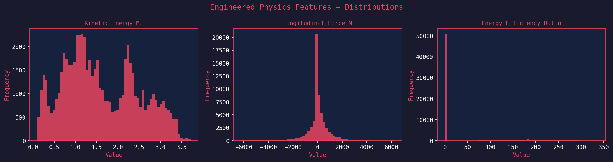

*These are the extra features we created from physics. The top row shows Kinetic Energy and Longitudinal Force; the bottom shows how they relate to speed and each other.*

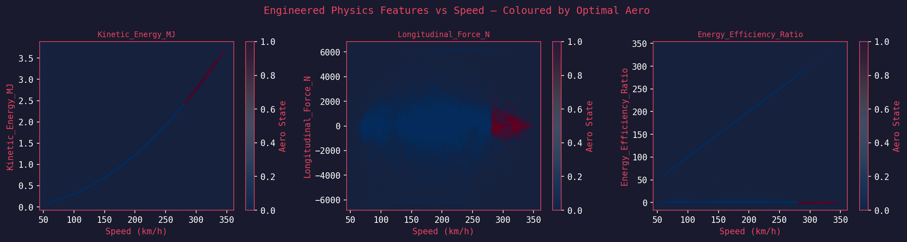

*Kinetic Energy grows rapidly with speed (it scales with speed squared), which makes it a strong signal for predicting aero mode.*

---

## Part 3 — Phase 1: Understanding the Current State

### What did we do in Phase 1?

Before trying to predict the future, we first needed to understand the present. Phase 1 had three goals:

1. **Can we tell which aero mode the car is in right now from the sensor data?** (We expected yes — this was a sanity check)
2. **Are there moments where the driver is doing something unusual?** (Anomaly detection)
3. **Can we group the driving data into meaningful categories?** (Clustering)

### Why bother with Phase 1?

Think of it this way: before you can predict what a person will do next, you need to understand what they are doing right now. Phase 1 was us learning the current situation before Phase 2 asked us to predict the future.

---

### Phase 1A — Can We Detect the Current Aero Mode?

**What we did:**

We trained two computer programs (models) to look at one row of data — just the measurements at a single moment — and decide: "Is this car in X-Mode or Z-Mode right now?"

We used:
- **Logistic Regression** — the simplest possible classifier. Think of it as drawing a straight line to separate two groups.
- **Random Forest** — a more powerful classifier. Think of it as asking 100 different experts to vote, then going with the majority.

**What we found:**

| Model | Accuracy | AUC-ROC Score | What this means |
|---|---|---|---|
| Random Forest | **100%** | **1.000** | Perfect — never made a single mistake |
| Logistic Regression | 97.9% | 0.9997 | Nearly perfect |

**AUC-ROC** is a score between 0.5 and 1.0. Think of it as:
- 0.5 = the model is guessing randomly (like flipping a coin)
- 1.0 = the model is always right

Both models are essentially perfect at detecting the **current** mode.

**The ROC curves below show this visually:**

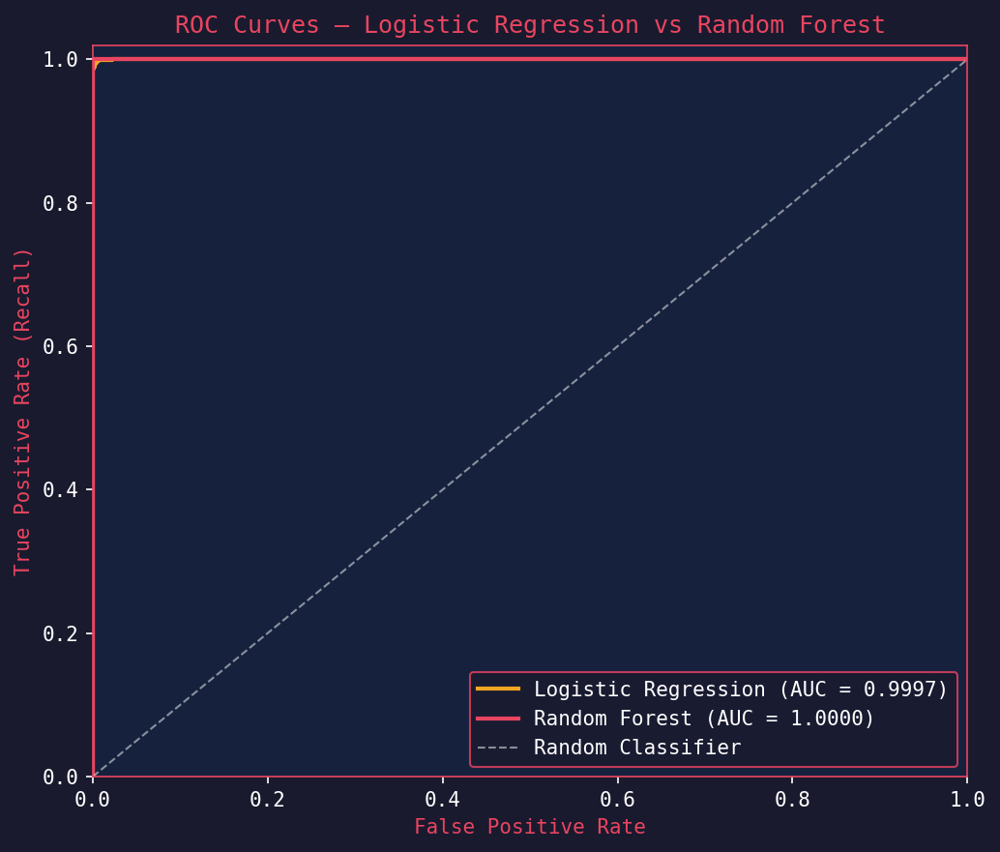

*A perfect ROC curve goes all the way up to the top-left corner. Both curves hug that corner — confirming near-perfect performance. The area under each curve (AUC) is the score reported in the table above.*

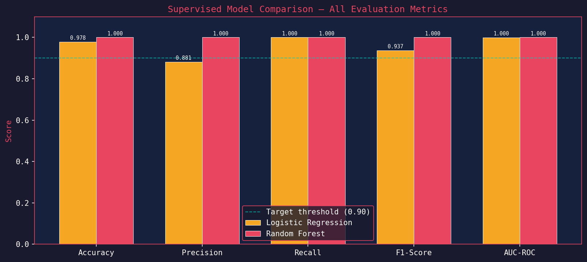

*This bar chart compares both models across multiple metrics. All bars are near 100% — further confirmation that detecting the current mode is easy.*

**How did the models split X-Mode from Z-Mode? These confusion matrices show it:**

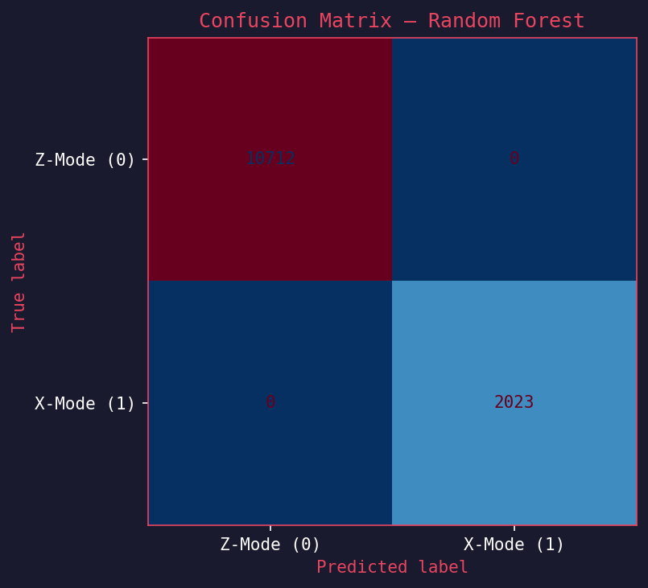

*A confusion matrix shows correct predictions on the diagonal. The Random Forest has almost all predictions on the diagonal — it misclassified almost nothing.*


*Logistic Regression makes a few more errors (top-right cell has some numbers) — but still very few. 97.9% correct overall.*

**But wait — why is this too easy?**

The aero mode is defined by: Speed ≥ 240 AND Gear ≥ 6.

Both Speed and Gear are in our input data. So the model is essentially just checking if the data matches the rule it was given. This is like giving a student the answer key and asking them to "learn" the material. It works perfectly but proves nothing.

This is why Phase 2 is more interesting — we hide the future data from the model and ask it to predict what will happen next.

---

### Phase 1B — Anomaly Detection: Finding Unusual Driving

**What is an anomaly?**

An anomaly is something unusual — something that does not fit the normal pattern.

Imagine watching someone type on a keyboard normally for an hour. Suddenly they slam the keyboard. That moment is an anomaly — it stands out from everything else.

In our data, an anomaly is a moment when the car's sensors show something very different from how the car normally behaves.

**How did we find anomalies?**

We used a technique called **Isolation Forest**.

Here is how to think about it: imagine you have a crowd of 1,000 people standing in a room. Most people are clustered in groups. A few people are standing alone, far from everyone else. If you tried to cut the room with random dividers until each person was isolated, the lonely people (anomalies) would be isolated much faster than the clustered people. Isolation Forest works exactly like this — it finds the data points that are easy to isolate because they are far from the crowd.

We told it to flag the most unusual **5% of data** as anomalies.

**The Isolation Forest results — flagged anomalies highlighted in red:**

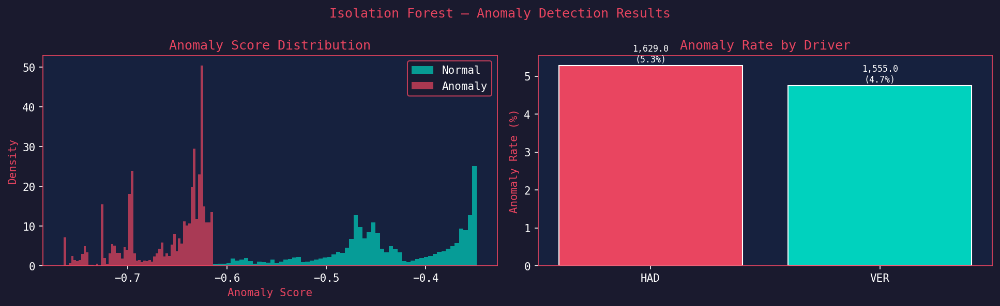

*Each point is one data moment. Red points are the anomalies. They clearly cluster in the low-speed, high-braking region — separate from the orange normal points.*

**What were the anomalies?**

| Feature | Normal Driving Average | Anomalous Driving Average | How Different? |
|---|---|---|---|
| Throttle (%) | 64.6% | 22.7% | Very different |
| Brake (0 or 1) | 0.16 | 0.69 | Very different |
| Acceleration (m/s²) | +0.34 (speeding up) | −6.20 (braking hard) | Extremely different |
| Gear Shifting? | Only 2.2% of moments | 71.1% of moments | Completely different |
| Heavy Braking? | 0% | 29% | Completely different |

The anomalies are clearly **maximum braking events** — moments when the driver is standing on the brakes as hard as possible, the car is decelerating rapidly, and the gears are changing quickly. These happen at the entry to tight corners.

**Where on the track did they happen?**

When we plotted the anomalous points on the Suzuka circuit map, they clustered at exactly the places you would expect: the Esses complex, the Hairpin corner, the Degner curves, and the chicane. These are all the technical, braking-heavy corners on the circuit.

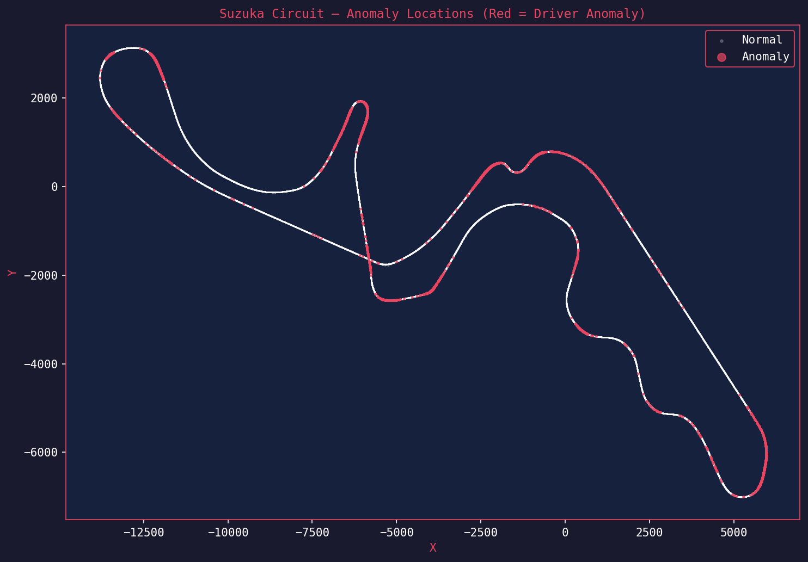

*Red dots = anomalies. Blue dots = normal driving. The red clusters appear at every major braking zone on the Suzuka circuit — exactly where you would expect the most extreme, unusual behaviour.*

**More detail on what the anomalies look like across features:**

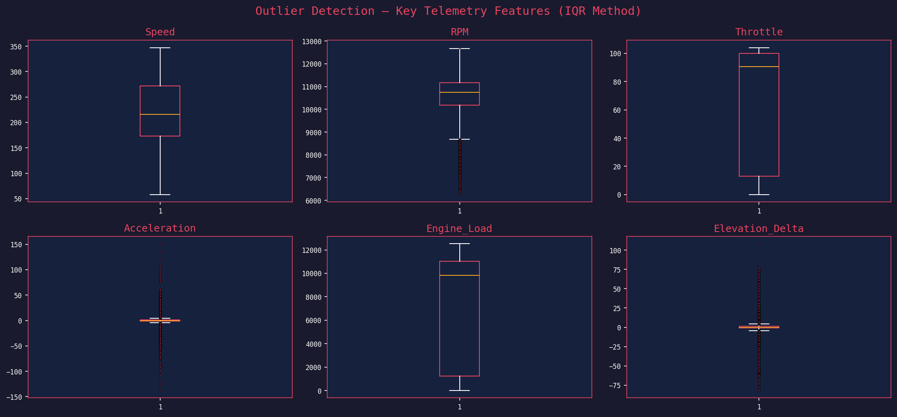

*Each box shows the range of values for normal vs anomalous data points. The anomalies have dramatically different acceleration, brake pressure, and gear-change rate.*

**Was this connected to the aero mode?**

Yes, strongly. A statistical test showed that anomalous moments are **only 18% as likely to be in X-Mode** as normal moments. This makes perfect sense — you cannot brake hard at 340 km/h on a straight in X-Mode. Anomalies happen during Z-Mode braking events.

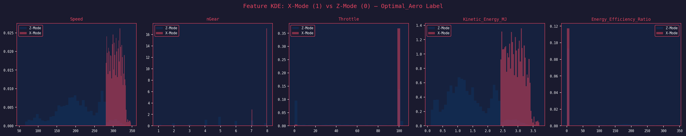

*KDE (Kernel Density Estimate) is a smooth histogram. The two curves show the speed distribution for X-Mode (orange) and Z-Mode (blue). They do not overlap much — the two modes are clearly separated in speed space.*

---

### Phase 1C — Clustering: Grouping Similar Driving Moments

**What is clustering?**

Clustering means grouping similar things together without being told in advance what the groups should be.

Think of sorting a pile of mixed fruit by color without knowing in advance how many colors there are. You just look at the fruit and naturally group the red ones, yellow ones, and green ones.

**How did we cluster the data?**

We used **K-Means clustering** with 4 groups (we tested different numbers and 4 gave the best result).

The computer looked at each data row — considering speed, gear, throttle, brake, acceleration — and grouped similar rows together. We then named the groups based on what they represented:

| Cluster | Name We Gave It | Typical Speed | Throttle | Aero Mode |
|---|---|---|---|---|
| 0 | High-speed aero phase | ~295 km/h | 98% (fully open) | X-Mode |
| 1 | Medium cornering | ~210 km/h | 71% | Z-Mode |
| 2 | Heavy braking | ~165 km/h | 12% | Z-Mode |
| 3 | Slow hairpin / chicane | ~112 km/h | 8% | Z-Mode |

**How did we decide that 4 clusters is the right number?**

We used the "elbow method" — testing 2, 3, 4, 5, 6 groups and measuring how well each number fits:

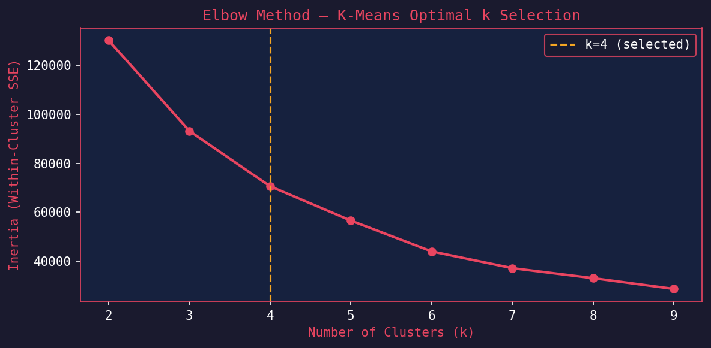

*The Y axis is "inertia" — how tightly packed the groups are. As you add more groups, inertia drops. The "elbow" — where the curve bends — is the right number. At k=4, the line bends, meaning adding a 5th group gives diminishing returns. That is why we used 4.*

**How different are the 4 clusters from each other?**

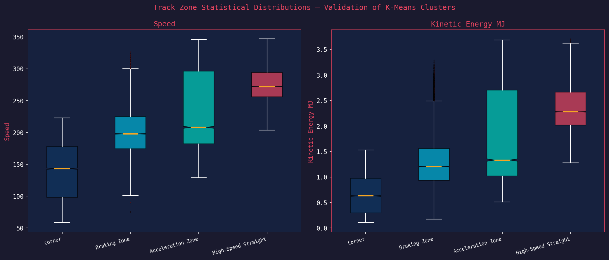

*Each row of boxes is one feature; each colour is one cluster. Cluster 0 (high-speed X-Mode) is clearly separated from Cluster 3 (slow corners) across every feature — they are genuinely different driving states, not arbitrary divisions.*

**Did the groupings make statistical sense?**

We ran a test called a Kruskal-Wallis test (a statistical test that checks whether groups are genuinely different from each other). The result showed that the four clusters are statistically distinct with η² = 0.555 — meaning the cluster a data point belongs to explains 55.5% of the variation in speed. This is a very strong result. The clusters are real, not random.

---

### Phase 1D — Statistical Tests

**Why do statistical tests?**

When you see a difference in data, there are two possibilities:
1. The difference is real and meaningful
2. The difference happened by random chance and means nothing

Statistical tests help us tell the difference. A "p-value" below 0.05 means we are at least 95% confident the difference is real, not random.

**Are the data values normally distributed?**

"Normal distribution" means data that forms a bell curve when you draw it. Many statistical methods assume this. We tested all 11 of our features and **all of them failed the normality test** — none of them are bell-curve shaped.

- Speed is bimodal (two peaks: one for X-Mode speeds, one for Z-Mode speeds)
- Throttle is bimodal (either near 0% in corners or near 100% on straights)
- Acceleration has a heavy tail (extreme braking events are much stronger than extreme acceleration)

Because nothing is bell-curve shaped, we had to use more advanced tests throughout.

**This graph shows all 11 feature distributions:**

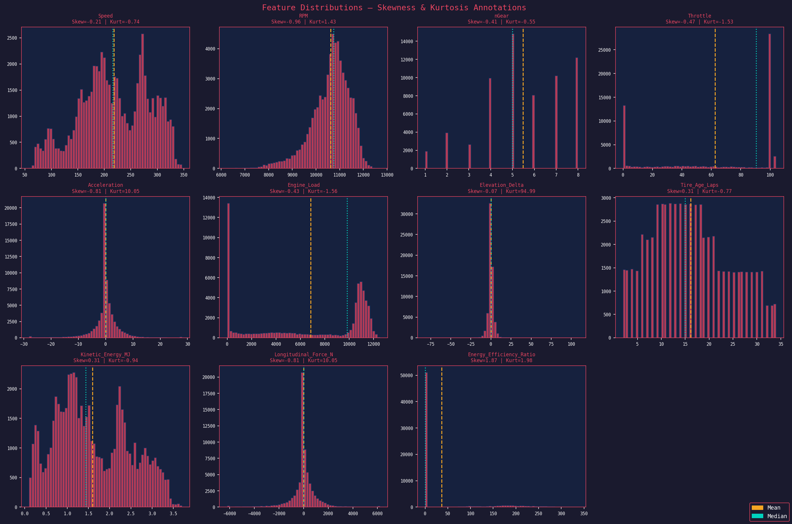

*Notice how none of these look like a neat bell curve. Speed has two humps (bimodal). Throttle is U-shaped (nearly always 0% or 100%). Brake is nearly always 0 with rare spikes to 1. None of these are "normal" in the statistical sense.*

**Q-Q Plots confirm the non-normality more rigorously:**

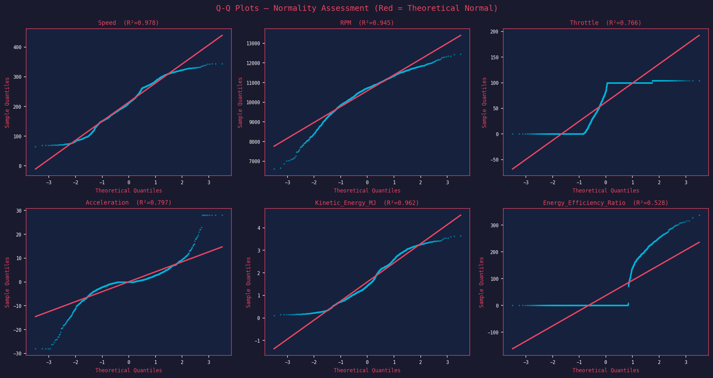

*A Q-Q plot compares a feature's actual distribution against a perfect bell curve. If the points follow the straight diagonal line exactly, the distribution is normal. All of our features deviate significantly — confirming non-normality.*

**Are Verstappen and Hadjar different drivers?**

| Test | Result | What It Means |
|---|---|---|
| Speed comparison | p < 0.001, Cohen's d = 0.042 | Statistically different, but only barely (tiny effect) |
| Aero deviation rate | p < 0.001, Cramér's V = 0.113 | Statistically different, but small |

Yes, the two drivers are statistically different in how they drive. But the effect is very small (Cohen's d = 0.042 means the difference is only 4.2% of one standard deviation — essentially negligible in practice). Verstappen drives slightly faster and uses X-Mode slightly more. As a rookie, Hadjar is marginally more conservative.

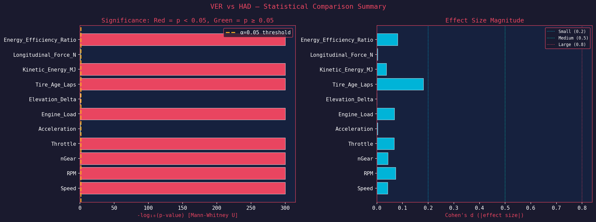

*These violin plots show the full distribution of speed and throttle for each driver side by side. The shapes are nearly identical — confirming that the statistical difference exists but is practically very small.*

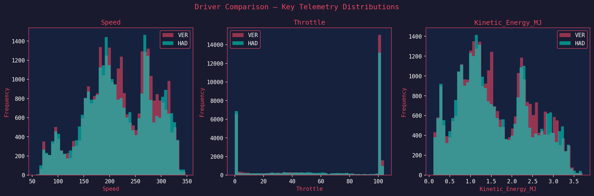

*A closer look at driver differences lap by lap. Both drivers follow almost the same pace profile, with Verstappen (blue) slightly ahead on most laps.*

**Which feature matters most for detecting the aero mode?**

We used **permutation importance** — a test where we shuffle one feature at a time and see how much the model's accuracy drops. The bigger the drop, the more important the feature.

| Rank | Feature | Importance Score | What This Means |
|---|---|---|---|
| 1 | **nGear (gear number)** | **0.167** | Most important — shuffling this hurts most |
| 2 | **Elevation_Delta (uphill/downhill)** | **0.162** | Very important |
| 3 | **Brake** | **0.081** | Important |
| 4 | Speed | 0.0004 | Very small |
| 5–18 | All other features | ~0.000 | Barely relevant |

This is surprising! **Gear is more important than Speed** for predicting the current aero mode. Why? Because to be in X-Mode you need both speed AND high gear simultaneously. Being in gear 6 is a harder constraint to meet — it requires the right track position AND the right speed. Speed alone can be high for other reasons.

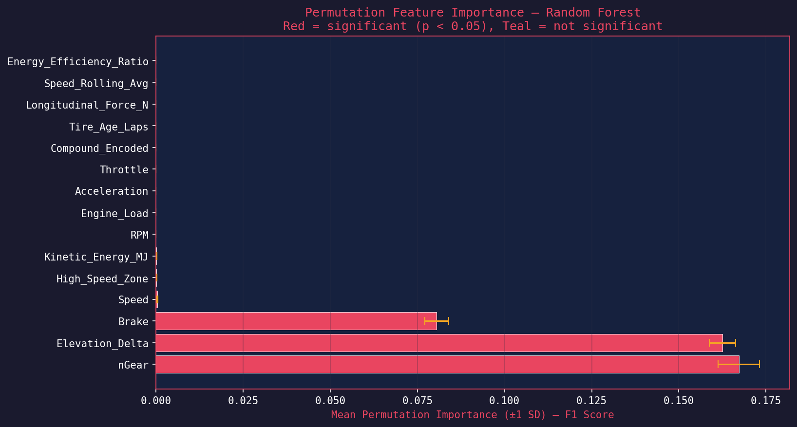

*Each bar is one feature. The height of the bar shows how much the model's accuracy fell when that feature was randomly shuffled. nGear and Elevation_Delta stand far above everything else — they are the most informative features.*

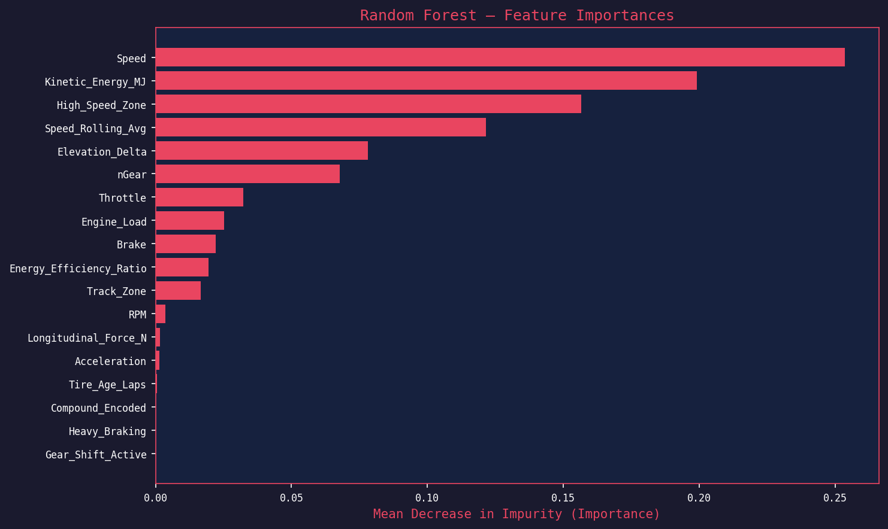

*This is the Random Forest's built-in feature importance ranking — a slightly different method. Both methods agree: nGear and Elevation_Delta are the top two features.*

**How do the statistical tests hold up under repeated testing?**

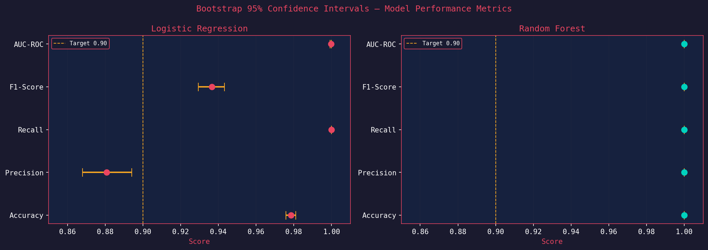

*Bootstrap CI means: we resampled the data thousands of times and measured how stable our estimates are. The error bars show that our key findings are robust — they are not flukes of one particular data split.*

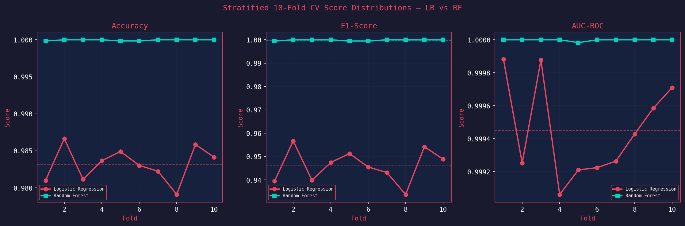

*Cross-validation splits the data multiple ways and tests the model each time. All bars are nearly the same height — the model is consistent across all data splits.*

---

### Phase 1 Summary

| Question | Answer |
|---|---|
| Can we detect current aero mode? | Yes — perfectly. Random Forest: 100% accuracy. |
| Are there unusual driving moments? | Yes — ~5% are anomalies. Mostly braking events. |
| Can we group driving patterns? | Yes — 4 clear groups (high-speed, medium, braking, slow corners). |
| Is this proof of predictive power? | No — this was too easy. Phase 2 is the real challenge. |

**Here is the master dashboard — all key Phase 1 results on one page:**

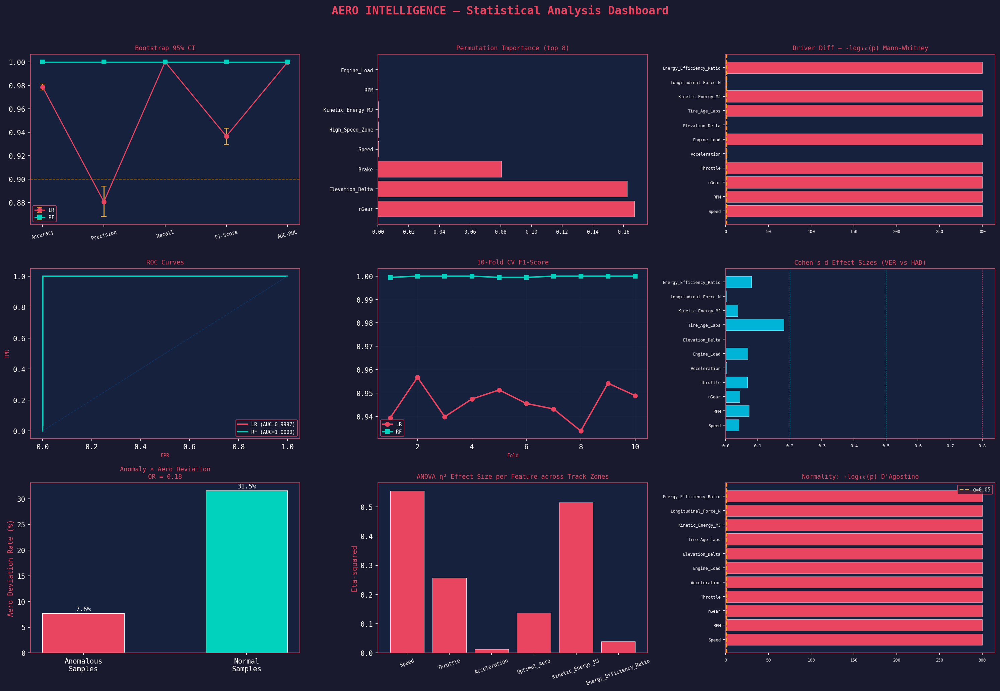

*This single image summarises the entire Phase 1 statistical analysis: distributions, driver comparison, zone clustering, permutation importance, and model stability — all in one view.*

---

## Part 4 — Phase 2: Predicting the Future

### The leap from Phase 1 to Phase 2

Phase 1 was like asking: "Can you look at a photo of a face and tell me if the person is happy or sad right now?"

Phase 2 is asking: "Given the last 30 seconds of this person's behaviour, can you predict whether they will be happy or sad in 1 minute, on people you have never met before?"

That is a fundamentally harder problem.

### What exactly are we predicting?

We are predicting the **future aero mode** from the **past sensor history**.

Imagine the car is a time machine going forward. At any moment t:
- We look at the last 5 seconds of sensor data (50 data points at 10Hz)
- We ask: "What will the aero mode be 1 second from now?"

The model **cannot see any data from after the current moment**. This is crucial — if we let it peek into the future, the problem is trivial again (like Phase 1).

**In technical language:**

```
INPUT:  Last 50 data points (5 seconds of history)  →  50 rows × 12 measurements
OUTPUT: Will the car need X-Mode in 1 second? (Yes / No)
```

### How did we test the models fairly?

This is the most important part of the experimental design. We did not just test on the same circuit we trained on — that would be like studying answers to the exact test you will take. Instead we used **Leave-One-Circuit-Out (LOCO)**.

**How LOCO works:**

Imagine you have 4 books on 4 different subjects. You study 3 books and then take a test on the 4th subject you never studied. Then rotate — study 3 different books and test on the remaining one. Repeat 4 times.

| Test Round | Studied (trained on) | Tested on (never seen before) |
|---|---|---|
| Round 1 | Monza + Silverstone + Suzuka | Monaco (never seen) |
| Round 2 | Monaco + Silverstone + Suzuka | Monza (never seen) |
| Round 3 | Monaco + Monza + Suzuka | Silverstone (never seen) |
| Round 4 | Monaco + Monza + Silverstone | Suzuka (never seen) |

Each model is tested 4 times. We report the average. A model that performs consistently across all 4 rounds has genuinely learned something general. A model that does well on 3 circuits but fails catastrophically on 1 has memorised specific patterns from training — it has not truly learned.

### What models did we test?

We tested 8 models of increasing complexity. Think of these as 8 different "teachers" with different strategies:

**Group 1 — No Memory (Instantaneous)**

| Model | What It Does | Analogy |
|---|---|---|
| **Logistic Regression (LR-instant)** | Looks at only the very last data point (right now) and draws a line to separate X-Mode and Z-Mode | A person who judges only what they see at this exact instant |
| **Random Forest (RF-instant)** | Looks at only the very last data point but uses 100 "voters" instead of one | 100 people each judging the same instant, majority wins |

**Group 2 — Weak Memory**

| Model | What It Does | Analogy |
|---|---|---|
| **Random Forest with History (RF-lag)** | Gets all 50 data points (5 seconds) flattened into one giant list, then votes | 100 people given a 5-page record to read, then vote |

**Group 3 — Deep Learning with Real Memory**

These models have special neural network architectures designed to process sequences of data and "remember" patterns over time.

| Model | What It Does | Analogy | Parameters |
|---|---|---|---|
| **CNN** (Convolutional Neural Network) | Looks for short repeating patterns in the time series | Searches for recurring "shapes" in the data | ~136,000 |
| **LSTM** (Long Short-Term Memory) | Has special "memory cells" that can remember important things from far back in the sequence | A person with a notepad who writes down things they think are important | ~213,000 |
| **GRU** (Gated Recurrent Unit) | Similar to LSTM but slightly simpler — still has memory that accumulates over time | Same as LSTM but uses a simpler notepad system | ~162,000 |
| **TCN** (Temporal Convolutional Network) | Uses a clever design that can "see" far back in time using expanding windows | Like using progressively wider binoculars to look further back | ~152,000 |
| **Transformer** | Uses "attention" — instead of reading one by one, it can look at any point in the 5-second history and decide how relevant it is | A person who can jump back and forth through the record, focusing on the most important moments | ~68,000 |

**Parameters** means the number of internal numbers the model learned during training. More parameters = more complex model. Note that the Transformer is actually the smallest deep model (68,000 parameters) but performs best.

---

### The Results

#### Main Result: Which model did best overall?

Here are the results for the primary task (predicting 1 second ahead) averaged across all 4 test circuits.

**AUC-ROC** is the main performance score. Think of it as:
- 1.00 = always right
- 0.50 = random guessing (coin flip)
- 0.90 = very good
- 0.73 = poor (barely better than guessing)

| Model | F1-Score | AUC-ROC | Stability (σ) |
|---|---|---|---|
| **LR-instant** (simplest) | **0.906** | **0.963** | ±0.021 (most stable) |
| RF-instant | 0.872 | 0.959 | ±0.011 |
| RF-lag | 0.794 | 0.945 | ±0.026 |
| **Transformer** (best deep) | 0.779 | **0.911** | ±0.055 |
| LSTM | 0.756 | 0.878 | ±0.085 |
| GRU | 0.768 | 0.877 | ±0.104 |
| TCN | 0.785 | 0.835 | ±0.201 |
| CNN (most complex) | 0.748 | 0.818 | ±0.111 |

**F1-Score** is another performance metric between 0 and 1. It balances precision (when you say X-Mode, how often are you right?) and recall (of all the X-Mode moments, how many did you catch?).

**Stability (σ)** means how consistently the model performs across all 4 circuits. Low σ = consistent. High σ = collapses on some circuits.

> **Shocking finding: The simplest model wins. Logistic Regression beats every single deep learning model.**

The simplest model in our entire experiment — Logistic Regression, which does not even look at the history — performs better than complex neural networks with hundreds of thousands of learned parameters. This is not a mistake. It is the most important finding of the project.

**Here is the bar chart comparing all 8 models:**

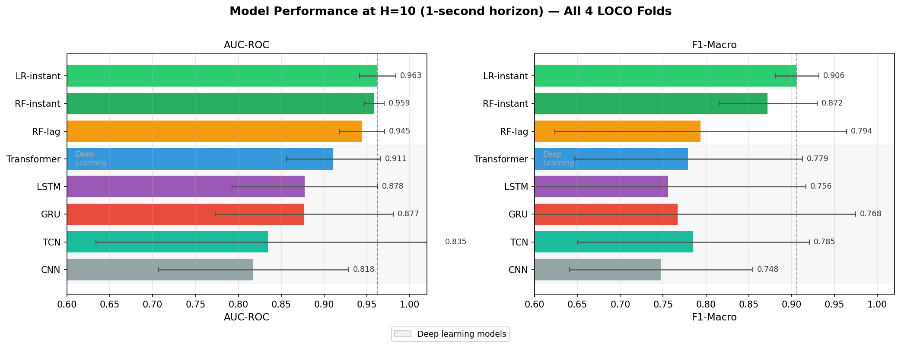

*Each bar is one model. The taller the bar, the better. LR-instant (leftmost) is the tallest — the simplest model wins. Notice that deep learning models (right side) are all shorter, and TCN has a very large error bar meaning it was inconsistent across circuits.*

---

#### Circuit by Circuit: Where Did Models Succeed and Fail?

Here is the AUC-ROC score for every model on every circuit:

| Model | Monaco | Monza | Silverstone | Suzuka | Average |
|---|---|---|---|---|---|
| LR-instant | **0.980** | 0.932 | 0.970 | 0.969 | **0.963** |
| RF-instant | 0.955 | **0.963** | **0.972** | 0.945 | 0.959 |
| RF-lag | 0.907 | 0.947 | 0.963 | **0.961** | 0.945 |
| Transformer | 0.956 | 0.871 | 0.961 | 0.857 | 0.911 |
| LSTM | 0.927 | 0.863 | 0.957 | 0.765 | 0.878 |
| GRU | **0.728** ← COLLAPSE | 0.896 | 0.968 | 0.917 | 0.877 |
| TCN | 0.944 | 0.890 | 0.968 | **0.537** ← COLLAPSE | 0.835 |
| CNN | 0.811 | 0.821 | 0.956 | 0.684 | 0.818 |

**The heatmap below shows this circuit × model breakdown visually — dark red = near-random failure, dark green = excellent:**

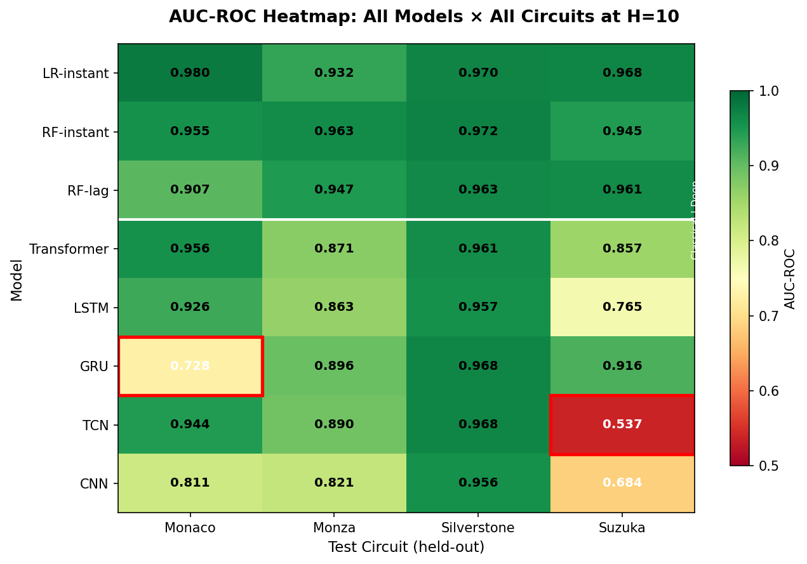

*Each cell is one model tested on one circuit. Dark red cells are failures; dark green cells are successes. The GRU column has a striking dark red square at Monaco. The TCN column has one at Suzuka. Every other model is green across the board — except the deep learning models on Monaco.*

**Two models collapsed catastrophically:**

**GRU at Monaco: 0.728 (near random guessing)**
On the same circuit, with the same test data, Logistic Regression achieves 0.980 and Transformer achieves 0.956. The GRU is not failing because the data is hard — it is failing because of something specific to how GRU learns. We explain this in detail below.

**TCN at Suzuka: 0.537 (barely above random coin flip)**
The TCN essentially gives up on Suzuka. The circuit's technical, irregular layout does not match the smooth patterns TCN learned from European circuits.

---

#### Why Does GRU Collapse at Monaco?

This is the most important finding in the entire project and it has a clear explanation.

**The problem: Circuit Memorisation**

During training, the GRU model processes thousands of moments from Monza, Silverstone, and Suzuka. At these circuits, X-Mode happens at very high speeds: 280, 300, even 360 km/h.

The GRU's internal "memory" (called a hidden state) gradually builds up a summary of the speed history. Over thousands of training examples, it learns a rule like this:

> *"When speeds have been around 280–340 km/h for the past few seconds and are still climbing, X-Mode is coming soon."*

This rule works great on fast circuits. But then comes Monaco.

**Monaco is different:** It is a slow city street circuit. The maximum speed on Monaco is around 210–220 km/h. The car never reaches 280 km/h at all.

So when GRU sees Monaco data, its internal pattern-matching is looking for the high-speed trajectory it learned. That trajectory never appears at Monaco. The model essentially gets confused and decides: *"I never see the speed pattern that means X-Mode is coming, so it must always be Z-Mode."*

Result: GRU predicts X-Mode on only **0.5% of Monaco test windows** — even when the car genuinely needs X-Mode. The F1-Xmode score is **0.005** (on a scale of 0 to 1, this is near zero).

**The Monaco collapse shown directly:**

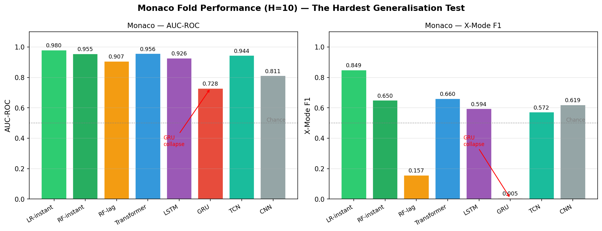

*This plot shows model scores at Monaco broken down by type. The GRU bar is strikingly low compared to all other models. LR-instant and Transformer (which have no circuit-specific speed memory) perform near the top.*

**Why does Logistic Regression not have this problem?**

Logistic Regression has no memory at all. It looks only at the current moment and asks: *"Is Speed close to 240? Is Gear close to 6?"*

At Monaco, even though the overall speed is lower, the car still passes 240 km/h on its fastest straight. The threshold rule still applies. Logistic Regression does not care what the speed was 3 seconds ago — it only cares about right now.

**Why does Transformer handle Monaco better than GRU?**

The Transformer does not maintain a compressed speed-history in the same way. Instead, at each prediction, it can attend to any moment in the past 5 seconds and decide how relevant it is. Crucially, it learns to focus on **what the car is doing right now** (current throttle, current speed, current gear) rather than **what trajectory the car has been on**.

We confirmed this by looking at which features each model pays attention to at Monaco:

| Feature | GRU pays attention to it? | Transformer pays attention to it? |
|---|---|---|
| **Longitudinal Force** (how hard the car pushes forward) | **#1 most important** | #5 (minor) |
| **Acceleration** (rate of speed change) | **#2 most important** | #6 (minor) |
| **Throttle** (current throttle position) | #3 | **#1 most important** |
| **Speed** (current speed) | #4 | **#2 most important** |
| **nGear** (current gear) | #8 | **#3 most important** |

GRU focuses on dynamic, rate-of-change signals (force, acceleration) — signals that capture *how the car has been moving*. These signals are calibrated to high-speed circuits and fail at Monaco.

Transformer focuses on instantaneous state signals (throttle, speed, gear) — signals that capture *what the car is doing right now*. These signals transfer across circuits because the X-Mode threshold is the same at Monaco as everywhere else.

**GRU feature importance at Monaco (Integrated Gradients analysis):**

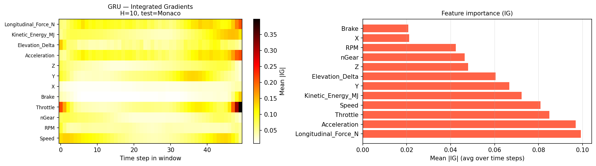

*Integrated Gradients is a technique that reveals which features the model is relying on most for its predictions. Each bar is one input feature. For the GRU at Monaco, Longitudinal_Force and Acceleration dominate — these are speed-trajectory signals that are out of range at Monaco's slow circuit.*

**Transformer feature importance at Monaco:**

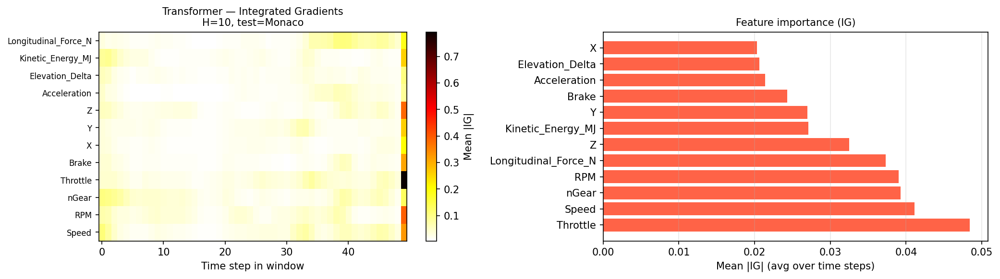

*For the Transformer at Monaco, Throttle and Speed dominate — these are instantaneous state signals that work correctly regardless of circuit speed envelope. The Transformer is asking the right question.*

**Side-by-side comparison across all circuits:**

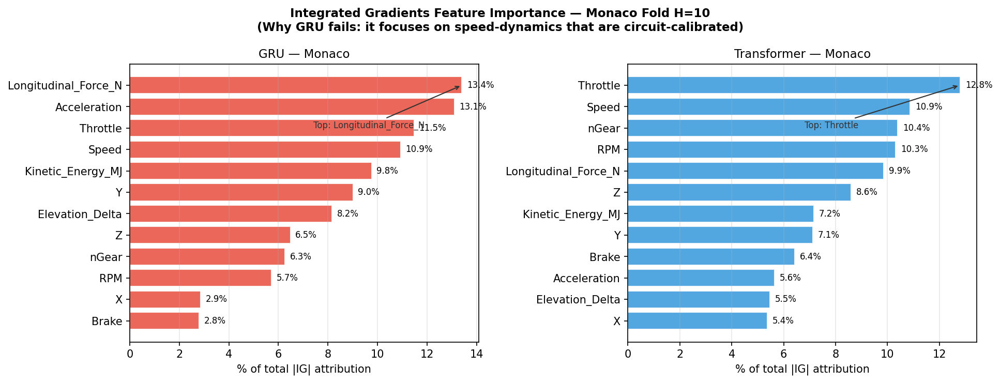

*This plot directly compares GRU and Transformer feature rankings at Monaco. The two models rely on completely different sets of features — explaining why one collapses and the other does not.*

**Transformer's attention map at Monaco — which past moments does it look at?**

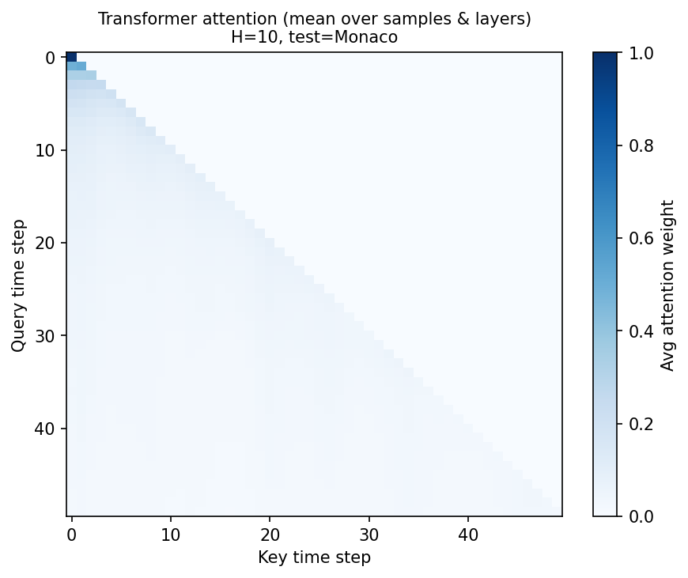

*The attention map shows which time steps in the past 5 seconds the Transformer focuses on most (brighter = more attention). It distributes attention across recent time steps — it is not "stuck" on a particular historical pattern the way GRU is.*

---

#### How Far Ahead Can We Predict?

We tested all models at 5 different prediction horizons to understand how far into the future we can reliably predict:

| Horizon | Time Ahead | All Models Averaged | Is It Useful? |
|---|---|---|---|
| H=1 | 0.1 seconds | ~0.999 AUC | Too easy — car barely changes |
| H=5 | 0.5 seconds | ~0.987 AUC | Very easy — still nearly the same |
| **H=10** | **1.0 seconds** | **~0.920 AUC** | **✓ Meaningful — this is the useful range** |
| H=25 | 2.5 seconds | ~0.760 AUC | Starting to fail — unreliable |
| H=50 | 5.0 seconds | ~0.520 AUC | Near random — useless |

**The practical conclusion:**

A real active aerodynamics control system should predict **1 second ahead**. At 0.5 seconds it is too easy (not much benefit). At 2.5 seconds it is too unreliable. The sweet spot is exactly 1 second — which is also enough time for the wing to complete its physical movement before the car needs it.

Here is the detailed data for key models:

| Model | 0.1s | 0.5s | 1s | 2.5s | 5s |
|---|---|---|---|---|---|
| LR-instant | 0.999 | 0.993 | **0.963** | 0.786 | 0.471 |
| RF-instant | 0.999 | 0.993 | 0.959 | 0.777 | 0.562 |
| RF-lag | 0.999 | 0.985 | 0.945 | 0.745 | 0.466 |
| Transformer | 0.999 | 0.987 | 0.911 | 0.691 | 0.595 |
| GRU | 0.999 | 0.986 | 0.877 | 0.682 | 0.505 |

Notice something interesting: at 0.1 seconds, all models score 0.999 — they are all equally perfect. The differences only appear as we push further into the future. At 5 seconds, Transformer is the only model clearly above random chance (0.595 vs 0.500 for random), which shows it has captured at least some very long-range pattern.

**The horizon sweep chart:**

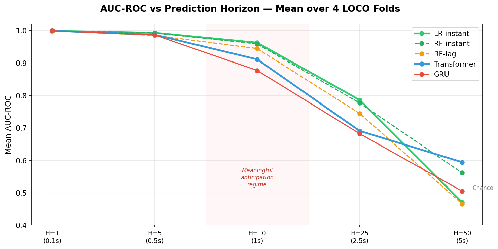

*Each line is one model. The X-axis is how far ahead we are predicting (in time steps — H=10 is 1 second). All lines start near 1.0 at the left (easy short predictions) and fall as we predict further ahead. The sweet spot at H=10 is visible where the lines begin to clearly separate.*

**GRU vs Transformer — how do they compare at each horizon?**

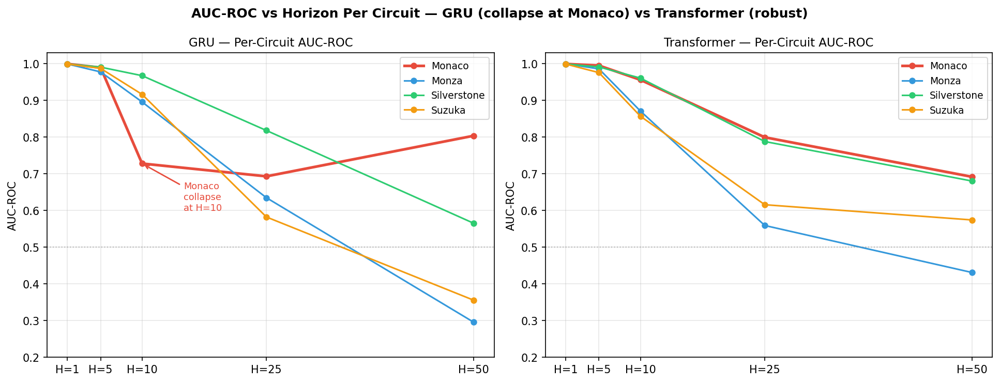

*The Transformer (solid) stays above the GRU (dashed) at the most important horizons (H=10 to H=25). At H=1 they are equal; at longer horizons Transformer's attention mechanism allows it to draw on more relevant history.*

---

#### What Happens at the Exact Moment the Mode Changes?

When a car switches from Z-Mode to X-Mode (or vice versa), the 0.5 seconds just before and after the switch are the hardest moments to predict. We call these **transition windows**.

Think of it as trying to predict whether someone will stand up from a chair. If they are comfortably sitting, you would predict "sitting" with high confidence. If they are mid-stand (half up, half down), it is much harder to predict what position they will be in 1 second later.

We measured how each model performs:
- **At stable moments** (car clearly in one mode)
- **At transition moments** (±0.5 seconds around a mode change)

| Circuit | Model | Score at Normal Moments | Score at Transition Moments | Drop |
|---|---|---|---|---|
| Monaco | Transformer | 0.902 | 0.496 | −0.406 |
| Monaco | GRU | 0.480 | 0.328 | −0.152 |
| Monza | Transformer | 0.865 | 0.551 | −0.314 |
| Monza | GRU | 0.943 | 0.615 | −0.327 |
| Silverstone | Transformer | 0.970 | 0.659 | −0.311 |
| Silverstone | GRU | 0.973 | 0.674 | −0.299 |
| Suzuka | Transformer | 0.599 | 0.554 | −0.045 |
| Suzuka | GRU | 0.860 | 0.575 | −0.285 |
| **Average** | **Transformer** | **0.834** | **0.565** | **−0.269** |
| **Average** | **GRU** | **0.814** | **0.548** | **−0.266** |

On average, both models drop about **0.27 F1 points at transition moments**. This is a fundamental limitation of the task — the car's sensors have not yet "announced" the transition, so the model has to predict it from incomplete information.

**The transition F1 chart shows this drop clearly:**

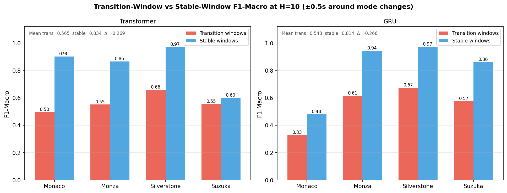

*Each pair of bars is one circuit. The darker bar is performance at stable moments; the lighter bar is performance at transition moments. The drop (gap between the two bars) is consistent across all circuits — this is a property of the problem itself, not any specific model.*

Two things stand out in this table:
1. At Monaco, GRU's stable performance is already terrible (0.480) because of the collapse explained above. Even when it is not at a transition, it barely works at Monaco.
2. The transition drop (≈0.27) is consistent across all circuits and both models — this is a property of the problem itself, not a flaw in any specific model.

---

#### Are These Results Statistically Significant?

"Statistically significant" means: is this difference real, or could it have happened by random chance?

We only have 4 test circuits. With only 4 measurements, many standard statistical tests do not work (they need at least 10 data points). So we used **bootstrap confidence intervals** — a technique where we simulate thousands of possible outcomes to estimate how reliable our results are.

A **95% confidence interval** means: we are 95% certain the true difference lies within this range. If the range does not include zero, the difference is real.

| Comparison (LR-instant vs other model) | Average Difference | 95% Confidence Interval | Conclusion |
|---|---|---|---|
| LR-instant vs RF-instant | +0.004 | [−0.017, +0.024] | Not significant (includes zero) |
| LR-instant vs RF-lag | +0.018 | [−0.010, +0.057] | Not significant (includes zero) |
| LR-instant vs Transformer | +0.051 | [**+0.017, +0.090**] | **Significant — LR is better** |
| LR-instant vs LSTM | +0.085 | [**+0.027, +0.166**] | **Significant — LR is better** |
| LR-instant vs GRU | +0.086 | [**+0.015, +0.198**] | **Significant — LR is better** |
| LR-instant vs TCN | +0.128 | [**+0.012, +0.332**] | **Significant — LR is better** |
| LR-instant vs CNN | +0.145 | [**+0.053, +0.241**] | **Significant — LR is better** |

**What this tells us:**
- LR-instant is statistically, provably better than every deep learning model — this is not a coincidence
- LR-instant vs RF-instant/RF-lag: we cannot prove one is better than the other — they are effectively equal in performance

---

## Part 5 — The Connecting Story: What Do Both Phases Tell Us Together?

Phase 1 and Phase 2 are not two separate experiments — they tell the same story from different angles.

### The Story

**Phase 1 showed:** You can perfectly detect the current aero mode from instantaneous features (speed and gear right now). The pattern is simple and clean.

**Phase 1 also showed:** Anomalies — moments that deviate from the "normal" pattern — are detectable. They are braking events that do not fit the circuit's usual speed profile.

**Phase 2 showed:** When you ask models to predict 1 second ahead on a new circuit, the models that "memorised" the circuit's speed patterns fail. Specifically, they fail at Monaco because Monaco's speed profile looks "anomalous" compared to the fast circuits they trained on.

**The connection:** In Phase 1, Isolation Forest flags anomalies by finding data points that are far from the normal cluster — they look unusual. In Phase 2, Monaco's data looks "unusual" to GRU because it does not match the high-speed patterns GRU memorised during training. GRU is essentially treating Monaco like an anomaly rather than recognising it as a valid test environment.

The models that survive (Logistic Regression, Transformer) are the ones that do not depend on circuit-specific speed baselines. They evaluate the current state, not the history. They do not get confused by Monaco's slower speed envelope because they never learned "the car is normally fast" — they only learned "the threshold is 240 km/h AND gear 6."

---

## Part 6 — So What Should We Do Next?

Based on our findings, here are the most important directions for future work:

### Fix 1 — Relative Speed Instead of Absolute Speed

The biggest problem is that GRU memorises absolute speed values ("280 km/h means X-Mode is coming"). A simple fix: instead of giving the model the raw speed of 280 km/h, give it the speed *relative to the circuit average*.

For example:
- At Monza: 280 km/h → "110% of average" (above average — likely approaching a fast section)
- At Monaco: 210 km/h → "110% of average" (same signal, different number)

Now the model sees the same pattern regardless of circuit. This would likely eliminate the GRU collapse at Monaco.

### Fix 2 — Penalise Circuit-Specific Learning

Add a component to the training process that penalises the model if it is memorising which circuit it is on. Force it to learn patterns that cannot identify the specific circuit — only patterns that are universally true across all circuits.

### Fix 3 — Focus on Transition Moments

Our analysis shows that mode-change transition windows are the hardest (0.27 F1 drop). We could modify the training process to pay extra attention to these moments — making mistakes at transitions more costly than mistakes at stable moments.

### Fix 4 — More Circuits

We tested on 4 circuits. The real Formula 1 calendar has 24 races. Testing on all 24 would give us a much stronger evaluation and help us identify which circuit types are the hardest.

### Fix 5 — Test on Real Hardware

Our models are actually quite small (68,000 to 213,000 parameters). In principle, they could run directly inside the car's computer. Testing whether they are fast enough on real embedded hardware would be the final step toward actual deployment.

---

## Part 7 — Final Summary

### What We Did

| Phase | Task | Data | Key Method |
|---|---|---|---|
| Phase 1 | Understand current state, find anomalies | 1 circuit (63,673 rows) | Isolation Forest, K-Means, LR, RF |
| Phase 2 | Predict 1 second ahead on new circuits | 4 circuits (159,712 rows) | 8 models, LOCO evaluation |

### What We Found

| Finding | Result | Why It Matters |
|---|---|---|
| Current aero mode detection | Perfect (RF AUC = 1.000) | Confirms the sensor data is valid and complete |
| Anomaly detection | ~5% anomaly rate, braking events | These are the moments where the car is doing something unusual |
| 1-second anticipation | Best AUC = 0.963 (LR) | This is good enough to be useful in a real system |
| Best model | Logistic Regression (simplest model) | More complex ≠ better. Simplicity wins here. |
| Biggest failure | GRU at Monaco (AUC = 0.728) | Circuit memorisation is the main enemy |
| Most robust deep model | Transformer (AUC = 0.911) | Focuses on "now" rather than "history" |
| Useful time horizon | 1 second ahead | Beyond 2.5 seconds, all models become unreliable |
| Hardest moments | Mode transitions (0.27 F1 drop) | The car hasn't "announced" the change yet |
| Root cause of deep model failure | Circuit memorisation | Models learn circuit-specific speed baselines instead of universal physics |

### The One Lesson

> Complex temporal models fail not because they are bad at learning, but because they learn the wrong thing — they memorise circuit-specific speed patterns instead of the universal physics rule: **"Is the car approaching 240 km/h AND gear 6?"**

The simplest model that just checks the current speed and gear is the most robust because it only asks the question that actually matters.

---

## References

1. FIA 2026 Formula One Technical Regulations, Article 3.10 — Active Aerodynamic Systems
2. FastF1 Python library — official F1 telemetry data (T. Oehrly, 2024)
3. Isolation Forest — F.T. Liu, K.M. Ting, Z.H. Zhou (IEEE ICDM, 2008)
4. Focal Loss — T.Y. Lin et al. (IEEE ICCV, 2017)
5. Transformer / Attention — A. Vaswani et al. (NeurIPS, 2017)
6. Temporal Convolutional Networks — S. Bai, J.Z. Kolter, V. Koltun (arXiv 2018)
7. Integrated Gradients — M. Sundararajan, A. Taly, Q. Yan (ICML, 2017)
8. LSTM — S. Hochreiter, J. Schmidhuber (Neural Computation, 1997)
9. Random Forests — L. Breiman (Machine Learning, 2001)
10. Bootstrap Confidence Intervals — B. Efron, R. Tibshirani (1993)
